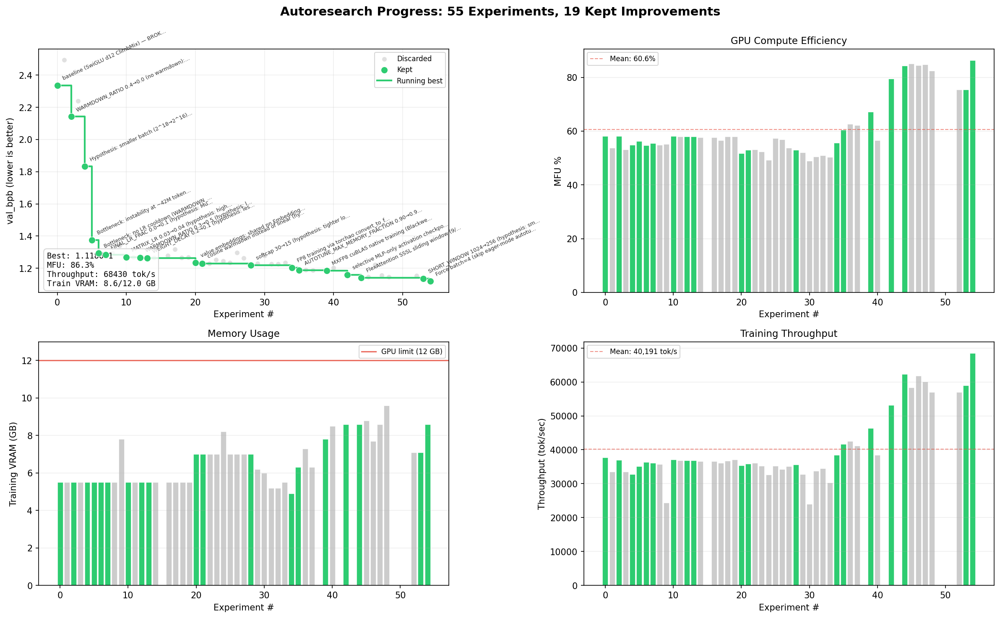

# TrainRTX5070

> Autonomous LLM pretraining research on a single RTX 5070.

> Fork of [karpathy/autoresearch](https://github.com/karpathy/autoresearch) via [jsegov/autoresearch-win-rtx](https://github.com/jsegov/autoresearch), optimized for RTX 5070 (12GB, Blackwell CC 12.0) on Windows.



*AI agent runs experiments autonomously: modify code, train for 20 minutes, check if val_bpb improved, keep or discard, repeat. You sleep, it researches.*

## Start the AI agent

```
Read program.md and CLAUDE.md. Continue the experiment loop on the autoresearch/mar10 branch. The baseline is already recorded in results.tsv. Start experimenting.
```

Paste this into Claude Code (with bypass permissions on). Then monitor:

```powershell
# Live training progress (updates every ~7 seconds)
Get-Content run.log -Tail 3 -Wait

# Experiment results (updates every ~25 minutes)
Get-Content results.tsv -Tail 10 -Wait
```

## About

Based on [karpathy/autoresearch](https://github.com/karpathy/autoresearch) — give an AI agent a small but real LLM training setup and let it experiment autonomously overnight. It modifies the code, trains for 20 minutes, checks if the result improved, keeps or discards, and repeats. You wake up to a log of experiments and (hopefully) a better model.

## Fork scope

- Upstream source: [karpathy/autoresearch](https://github.com/karpathy/autoresearch)
- Primary objective: run natively on Windows with desktop consumer NVIDIA GPUs (Turing with >=8 GB VRAM, Ampere/Ada/Blackwell with >=10 GB VRAM), without unofficial Triton-on-Windows stacks.
- Scope of changes: compatibility and stability updates required for that target platform.
- The original Linux/H100-oriented path from upstream is removed in this fork and is not supported here.
- If you need the upstream Linux/H100 path, use [karpathy/autoresearch](https://github.com/karpathy/autoresearch).

## How it works

The repo is deliberately kept small and only really has a three files that matter:

- **`prepare.py`** — data prep (downloads ClimbMix/TinyStories data, sets up GPT-2 or BPE tokenizer), and runtime utilities (dataloader, evaluation).
- **`train.py`** — the single file the agent edits. Contains the full GPT model (SwiGLU MLP, RoPE, d12 ~162M params), optimizer (Muon + AdamW), and training loop. Everything is fair game: architecture, hyperparameters, optimizer, batch size, etc. **This file is edited and iterated on by the agent**.
- **`program.md`** — baseline instructions for one agent. Point your agent here and let it go. **This file is edited and iterated on by the human**.

By design, training runs for a **fixed 20-minute time budget** (wall clock, excluding startup/compilation), regardless of the details of your compute. The metric is **val_bpb** (validation bits per byte) — lower is better, and vocab-size-independent so architectural changes are fairly compared.

## Quick start (PowerShell)

**Requirements:** A single NVIDIA GPU, Python 3.10+, [uv](https://docs.astral.sh/uv/).

- Runtime uses PyTorch SDPA attention with `is_causal=True` fast path and `torch.compile` (via `triton-windows`).
- Native Windows support targets desktop consumer GPUs with a tiered VRAM policy (Turing >=8 GB, Ampere/Ada/Blackwell >=10 GB), official PyTorch CUDA wheels.
- Default dataset is ClimbMix (pre-tokenized web text, GPT-2 tokenizer, 50K vocab) for research-grade findings that transfer across scales.

```powershell

# 1. Install uv project manager (if you don't already have it)
powershell -ExecutionPolicy ByPass -c "irm https://astral.sh/uv/install.ps1 | iex"

# 2. Install dependencies
uv sync

# 3. Download ClimbMix data and set up GPT-2 tokenizer (one-time, ~10 shards)
uv run prepare.py --dataset climbmix

# 4. Manually run a single training experiment (~20 min)
uv run train.py
```

Quick validation run (recommended after setup):

```powershell
uv run train.py --smoke-test
```

If the above commands all work ok, your setup is working and you can go into autonomous research mode.

## Running the agent

Simply spin up your Claude/Codex or whatever you want in this repo (and disable all permissions), then you can prompt something like:

```
Hi have a look at program.md and let's kick off a new experiment! let's do the setup first.
```

The `program.md` file is essentially a super lightweight "skill".

## Project structure

```
prepare.py      — constants, data prep (ClimbMix/TinyStories) + runtime utilities
train.py        — model (SwiGLU d12), optimizer, training loop (agent modifies this)
program.md      — agent instructions
pyproject.toml  — dependencies
```

## Design choices

- **Single file to modify.** The agent only touches `train.py`. This keeps the scope manageable and diffs reviewable.
- **Fixed time budget.** Training always runs for exactly 20 minutes, regardless of your specific platform. This means you can expect approx 3 experiments/hour and approx 24 experiments while you sleep. There are two upsides of this design decision. First, this makes experiments directly comparable regardless of what the agent changes (model size, batch size, architecture, etc). Second, this means that autoresearch will find the most optimal model for your platform in that time budget. The downside is that your runs (and results) become not comparable to other people running on other compute platforms.
- **Self-contained.** No external dependencies beyond PyTorch and a few small packages. No distributed training, no complex configs. One GPU, one file, one metric.

## Platform support

This fork's platform policy is explicit and tiered.

| Architecture | Minimum VRAM floor | Supported desktop consumer GPUs |
| --- | --- | --- |
| Turing | `>=8 GB` | `RTX 2060 12GB`, `RTX 2060 SUPER 8GB`, `RTX 2070 8GB`, `RTX 2070 SUPER 8GB`, `RTX 2080 8GB`, `RTX 2080 SUPER 8GB`, `RTX 2080 Ti 11GB` |
| Ampere | `>=10 GB` | `RTX 3060 12GB`, `RTX 3080 10GB`, `RTX 3080 12GB`, `RTX 3080 Ti 12GB`, `RTX 3090 24GB`, `RTX 3090 Ti 24GB` |
| Ada | `>=10 GB` | `RTX 4060 Ti 16GB`, `RTX 4070 12GB`, `RTX 4070 SUPER 12GB`, `RTX 4070 Ti 12GB`, `RTX 4070 Ti SUPER 16GB`, `RTX 4080 16GB`, `RTX 4080 SUPER 16GB`, `RTX 4090 24GB` |
| Blackwell | `>=10 GB` | `RTX 5060 Ti 16GB`, `RTX 5070 12GB`, `RTX 5070 Ti 16GB`, `RTX 5080 16GB`, `RTX 5090 32GB` |
- Desktop only: laptop GPUs are not officially supported due to wide power and thermal variance.
- Floor policy: Turing desktop GPUs are supported at >=8 GB VRAM; Ampere/Ada/Blackwell desktop GPUs require >=10 GB VRAM.
- `RTX 2060 6GB` remains out of matrix support due to VRAM floor.
- Runtime path uses PyTorch SDPA attention + `torch.compile` (via triton-windows) + Muon optimizer.
- Runtime adaptation is profile-driven: compute capability, BF16/TF32 support, OS, and VRAM tier determine candidate batch sizes and checkpointing strategy.
- Supported consumer profiles run a short eager-mode autotune pass and cache the selected candidate per GPU/runtime fingerprint.
- Autotune env controls: `AUTORESEARCH_DISABLE_AUTOTUNE=1` skips probing; `AUTORESEARCH_AUTOTUNE_REFRESH=1` refreshes the cached decision.
- Tested hardware in this repo remains RTX 3080 10 GB on Windows. Other listed SKUs are matrix-supported but may be less field-tested here.
- Non-goals for this fork include FA3/H100-specialized paths, AMD/ROCm, Apple Metal, and multi-GPU training.
- Default dataset is ClimbMix (nvidia/Nemotron-ClimbMix) with GPT-2 tokenizer. TinyStories remains available via `--dataset tinystories`.

## License

MIT
